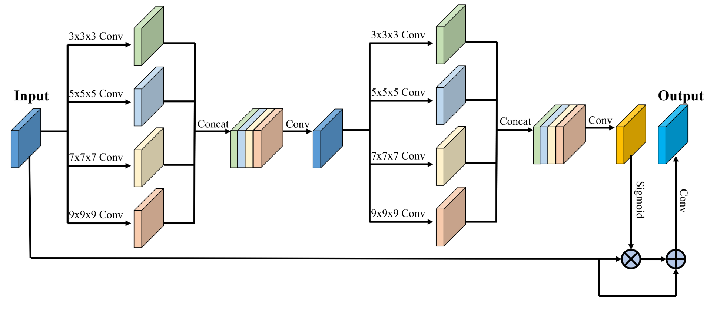
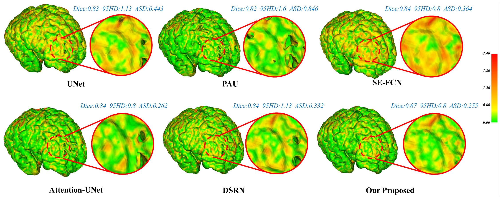

# Cortical Plate Segmentation in Fetal MRI. 
This repository is the implementation of the MixAttNet for cortical plate segmentation by Haoran Dou during his intership in Computational Radiology Lab at Boston Children's Hospital.

**A Deep Attentive Convolutional Neural Network for Automatic Cortical Plate Segmentation in Fetal MRI.**  
*Haoran Dou, Davood Karimi, Caitlin K. Rollins, Cynthia M. Ortinau, Lana Vasung, Clemente Velasco-Annis, Abdelhakim Ouaalam, Xin Yang, Dong Ni, Ali Gholipour.*   
Under Review



> Fetal cortical plate segmentation is essential in quantitative analysis of fetal brain maturation and cortical folding. Manual segmentation of the cortical plate, or manual refinement of automatic segmentations is tedious and time consuming, and automatic segmentation of the cortical plate is challenged by the relatively low resolution of the reconstructed fetal brain MRI scans compared to the thin structure of the cortical plate, partial voluming, and the wide range of variations in the morphology of the cortical plate as the brain matures during gestation. To reduce the burden of manual refinement of segmentations, we have developed a new and powerful deep learning segmentation method that exploits new deep attentive modules with mixed kernel convolutions within a fully convolutional neural network architecture that utilizes deep supervision and residual connections. Quantitative evaluation based on several performance measures and expert evaluations show that our method outperformed several state-of-the-art deep models for segmentation, as well as a state-of-the-art multi-atlas segmentation technique. In particular, we achieved average Dice similarity coefficient of 0.87, average Hausdroff distance of 0.96mm, and average symmetric surface difference of 0.28mm in cortical plate segmentation on reconstructed fetal brain MRI scans of fetuses scanned in the gestational age range of 16 to 39 weeks. By generating accurate cortical plate segmentations in less than 2 minutes, our method can facilitate and accelerate large-scale studies on normal and altered fetal brain cortical maturation and folding.

## Usage  
### Dependencies  
This work depends on the following libraries:  
Pytorch  
Nibabel  
Numpy  
[Volumentations](https://github.com/ashawkey/volumentations)  

### Train and Test
Run the following code to train the network  
```
python Train.py
```
Run the following code to test the network
```
python Infer.py
```
You can rewrite the DataOprate.py to train your own data.

## Result
Visual comparison of the segmentation results obtained from different methods.   
  
Visualization of the cortical surface error maps.  
  

## Relevant Resource
The relevant code can be also found at https://github.com/bchimagine  

## Citation  
If this work is helpful for you, please cite our paper as follow:   
```
@article{dou2020deep,
  title={A Deep Attentive Convolutional Neural Network for Automatic Cortical Plate Segmentation in Fetal MRI},
  author={Haoran Dou and Davood Karimi and Caitlin K. Rollins and Cynthia M. Ortinau and Lana Vasung and Clemente Velasco-Annis and Abdelhakim Ouaalam and Xin Yang and Dong Ni and Ali Gholipour},
  journal={ArXiv},
  year={2020},
  volume={abs/2004.12847}
}
```
